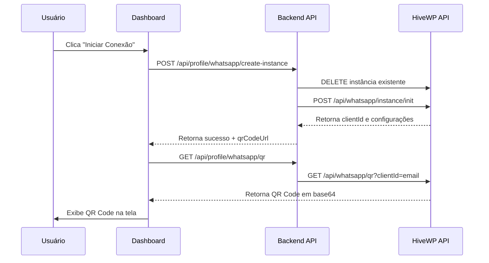

# 📱 Implementação QR Code - Sistema de Conexão WhatsApp

## 🎯 O que foi implementado?

O sistema agora permite que usuários criem suas próprias instâncias WhatsApp diretamente pelo dashboard, sem necessidade de intervenção do administrador.

### ✅ Novo Endpoint Criado

**Endpoint para Usuários Regulares:**
```http
POST /api/profile/whatsapp/create-instance
Authorization: Bearer {token_do_usuario}
Content-Type: application/json

{
  "options": {
    "ignoreGroups": true
  }
}
```

**Resposta de Sucesso:**
```json
{
    "success": true,
  "msg": "Instância WhatsApp criada com sucesso",
  "userEmail": "usuario@email.com",
  "clientId": "usuario@email.com",
  "qrCodeUrl": "https://api-url/api/whatsapp/qr-image?clientId=usuario@email.com",
  "status": "Instância criada - escaneie o QR Code"
}
```

## 🔧 Como Funciona

### 1. **Botão "Iniciar Conexão"**
- Localizado no dashboard do usuário
- Ao ser clicado, chama o endpoint `POST /api/profile/whatsapp/create-instance`
- Deleta automaticamente instância existente (se houver) antes de criar nova
- Cria uma nova instância WhatsApp para o usuário

### 2. **Fluxo Completo:**


### 3. **Arquivos Modificados:**

#### Backend:
- **`controllers/profileController.js`**: Nova função `createMyWhatsAppInstance`
- **`routes/profile.js`**: Nova rota `POST /whatsapp/create-instance`

#### Frontend:
- **`public/js/dashboard.js`**: Função `connectWhatsApp()` modificada
- **`public/js/dashboard.js`**: Função `updateConnectionUI()` melhorada

## 🚀 Como Usar

### Para o Usuário:
1. **Faça login** no sistema
2. **Acesse o dashboard**
3. **Clique em "Iniciar Conexão"** na seção WhatsApp
4. **Aguarde** a criação da instância e carregamento do QR Code
5. **Escaneie o QR Code** com o WhatsApp do celular
6. **Pronto!** Conexão estabelecida

### Para Testes:
```bash
# 1. Faça login e obtenha o token
curl -X POST http://localhost:3000/api/auth/login \
  -H "Content-Type: application/json" \
  -d '{"email": "usuario@email.com", "password": "senha123"}'

# 2. Use o token para criar instância
curl -X POST http://localhost:3000/api/profile/whatsapp/create-instance \
  -H "Authorization: Bearer SEU_TOKEN" \
  -H "Content-Type: application/json" \
  -d '{"options": {"ignoreGroups": true}}'

# 3. Busque o QR Code
curl -X GET http://localhost:3000/api/profile/whatsapp/qr \
  -H "Authorization: Bearer SEU_TOKEN"
```

## 🔍 Logs e Debugging

**Logs Importantes:**
```
[INFO] Tentando deletar instância existente para usuario@email.com antes de criar nova...
[INFO] Instância WhatsApp criada com sucesso para usuário usuario@email.com: usuario@email.com
[INFO] Criando instância WhatsApp para usuário: usuario@email.com (clientId: usuario@email.com)
```

**Debugging no Frontend:**
- Abra as **DevTools** do navegador
- Vá para a aba **Console**
- Clique em "Iniciar Conexão"
- Verifique se aparecem as mensagens:
  - `"Instância WhatsApp criada! Carregando QR Code..."`
  - `"QR Code carregado! Escaneie com seu WhatsApp."`

## ⚠️ Tratamento de Erros

### Cenários Comuns:

**1. Instância já existe:**
- Sistema deleta automaticamente antes de criar nova
- Usuário recebe feedback visual

**2. Erro na API externa:**
- Mensagem clara: "Erro ao criar instância WhatsApp"
- Log detalhado no servidor

**3. Token expirado:**
- Redirecionamento automático para login

**4. QR Code não carrega:**
- Botão "Atualizar QR" disponível
- Função `refreshQRCode()` pode ser chamada

## 🔧 Melhorias Implementadas

### Vantagens da Nova Implementação:

1. **✅ Autonomia do Usuário**: Não precisa do admin para criar instância
2. **✅ Refresh Automático**: Deleta e recria instância automaticamente
3. **✅ Feedback Visual**: Notificações claras para o usuário
4. **✅ Tratamento de Erros**: Logs detalhados e mensagens amigáveis
5. **✅ Interface Responsiva**: Botões se adaptam ao status da conexão

### Código Limpo:
- Separação clara entre frontend e backend
- Funções reutilizáveis
- Logs estruturados
- Tratamento de exceções adequado

---

## 📋 Próximos Passos Sugeridos

1. **Monitoramento Automático**: Verificar status da conexão periodicamente
2. **Reconexão Automática**: Detectar desconexões e tentar reconectar
3. **Webhook Integration**: Receber notificações de status da API
4. **Limite de Tentativas**: Evitar spam de criação de instâncias
5. **Cache de QR Code**: Armazenar temporariamente para evitar requests desnecessários

---

*Implementação concluída com sucesso! 🎉*

## 🎨 **Novo Feedback Visual Implementado**

### ✅ Detecção Inteligente de Status

O sistema agora detecta automaticamente quando o WhatsApp está conectado usando a resposta detalhada da API:

**Estrutura de Resposta Suportada:**
```json
{
    "msg": "Status da sua instância WhatsApp obtido com sucesso",
    "userEmail": "juan@gmail.com",
    "clientId": "juan@gmail.com",
    "status": {
        "success": true,
        "connected": true,
        "status": "open",
        "clientId": "juan@gmail.com"
    }
}
```

### 🎭 Estados Visuais Implementados

#### 1. **WhatsApp Conectado (`status.connected: true` && `status.status: "open"`)**
- **Indicador**: Verde com ícone de check ✅
- **Background**: Gradiente verde com sombra suave
- **Animações**: Pulso suave + ícone rotacionando com bounce
- **Notificação**: "🎉 WhatsApp conectado com sucesso!"
- **Layout**: Simples e limpo - apenas "WhatsApp Conectado!" e "Pronto para enviar mensagens"

#### 2. **Aguardando QR Code (`status: "connecting"` ou `"qr"`)**
- **Indicador**: Amarelo/laranja piscando
- **Background**: Gradiente laranja (`#f59e0b` → `#d97706`)
- **Animação**: Pulso contínuo
- **Botões**: "Desconectar" + "Atualizar QR"

#### 3. **Conexão Perdida (`status: "close"` ou `"closed"`)**
- **Indicador**: Vermelho com ícone de alerta ⚠️
- **Background**: Gradiente vermelho (`#ef4444` → `#dc2626`)
- **Notificação**: "⚠️ WhatsApp foi desconectado"
- **Ação**: Botão "Iniciar Conexão" para reconectar

#### 4. **Desconectado (padrão)**
- **Indicador**: Cinza neutro
- **Background**: Gradiente cinza (`#6b7280` → `#4b5563`)
- **Ação**: Botão "Iniciar Conexão"

### 🔄 Detecção de Mudanças de Status

**Sistema de Notificações Inteligente:**
- **Detecta mudanças**: Compara status anterior com atual
- **Notifica conexões**: Mostra alerta quando conecta
- **Notifica desconexões**: Avisa quando perde conexão
- **Evita spam**: Só notifica em mudanças reais de status

### 🎨 Melhorias Visuais

**Design Simplificado e Elegante:**
- ✅ **Layout minimalista**: Removido fundo colorido, apenas borda tracejada
- ✅ **Transparência**: Background transparente para máxima simplicidade
- ✅ **Foco no essencial**: Apenas ícone verde + texto em verde escuro
- ✅ **Bordas tracejadas**: Container com `border: 2px dashed #10b981`
- ✅ **Cores harmônicas**: Verde para ícone e texto principal, cinza para detalhes
- ✅ **Indicador de status**: Badge arredondado com gradiente mantido

**Animações CSS Melhoradas:**
```css
/* Pulso suave com mudança de cor da borda */
@keyframes connectedPulse {
    0% { transform: scale(1); border-color: #10b981; }
    50% { transform: scale(1.02); border-color: #059669; }
    100% { transform: scale(1); border-color: #10b981; }
}

/* Check com bounce simples */
@keyframes checkBounce {
    0% { transform: scale(0); }
    50% { transform: scale(1.2); }
    100% { transform: scale(1); }
}
```

### 🔧 Funções Principais

**1. `updateConnectionUI()` simplificada**
- Suporta estrutura aninhada de resposta
- Detecta `status.connected` e `status.status`
- Feedback visual limpo e elegante
- Foco no essencial: apenas status conectado/desconectado

**2. `handleStatusChange(newStatus, previousStatus)`**
- Detecta mudanças de status automaticamente
- Dispara notificações apenas quando necessário
- Registra logs para debugging
- Evita spam de notificações

**3. `checkWhatsAppStatus()` melhorada**
- Verifica status periodicamente (10 segundos)
- Logs detalhados para troubleshooting
- Trata erros graciosamente
- Atualiza UI automaticamente

### 🚀 Como Testar

**1. Simular Status Conectado:**
```javascript
// No console do navegador
updateConnectionUI({
    userEmail: "juan@gmail.com",
    clientId: "juan@gmail.com",
    status: {
        success: true,
        connected: true,
        status: "open",
        clientId: "juan@gmail.com"
    }
});
```

**2. Ver Mudanças de Status:**
- Conecte o WhatsApp via QR Code
- Observe as notificações automáticas
- Desconecte e veja o feedback visual

### 📱 Experiência do Usuário

**Fluxo Visual Melhorado:**
1. **Clica "Iniciar Conexão"** → Instância é criada
2. **Vê QR Code** → Interface mostra "Aguardando QR Code" (laranja)
3. **Escaneia QR Code** → Sistema detecta conexão automaticamente
4. **Ve confirmação visual** → Verde com animação + notificação
5. **Pronto para usar** → Interface mostra detalhes da conexão

---

*Feedback visual implementado com sucesso! 🎨✨*

**Quando conectado, o usuário verá:**
```
🟢 Conectado (badge verde arredondado)

┌- - - - - - - - - - - - - - - -┐
│           ✅                  │
│    WhatsApp Conectado!        │
│  Pronto para enviar msgs      │
└- - - - - - - - - - - - - - - -┘
     (container transparente 
      com borda tracejada verde)
``` 