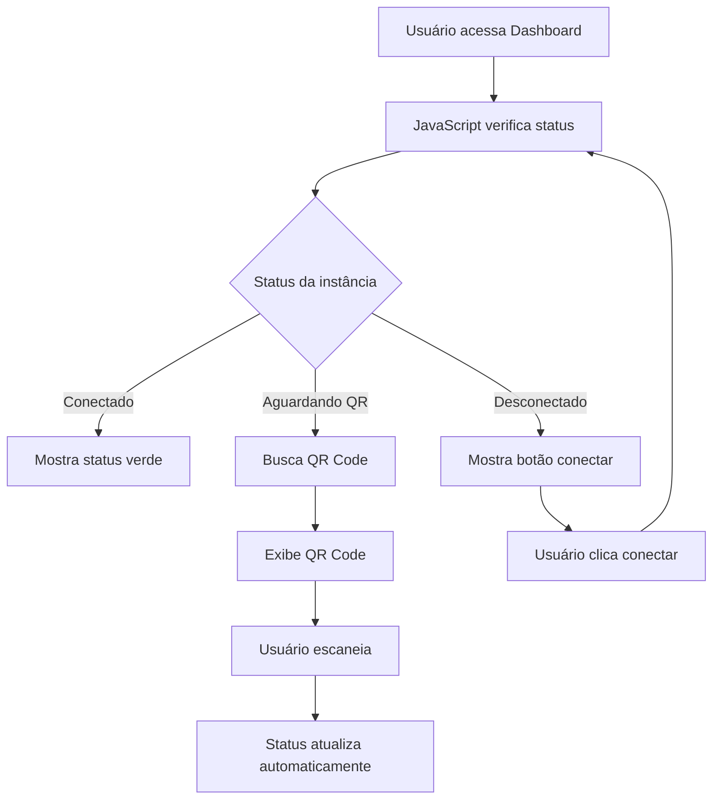

# Implementação do QR Code WhatsApp no Dashboard

## Visão Geral

Foi implementada a funcionalidade completa de QR Code do WhatsApp na tela de dashboard, permitindo que os usuários conectem suas instâncias WhatsApp diretamente através da interface web.

## Funcionalidades Implementadas

### 1. Endpoints da API

#### GET `/api/profile/whatsapp/qr`
- **Descrição**: Obtém o QR Code em formato base64 para autenticação
- **Autenticação**: Requer token JWT
- **Resposta**:
```json
{
    "success": true,
    "qrCode": "BASE64_STRING",
    "status": "connecting",
    "clientId": "user@email.com"
}
```

#### GET `/api/profile/whatsapp/status`
- **Descrição**: Verifica o status da conexão WhatsApp
- **Autenticação**: Requer token JWT
- **Resposta**:
```json
{
    "msg": "Status da sua instância WhatsApp obtido com sucesso",
    "userEmail": "user@email.com",
    "clientId": "user@email.com",
    "status": {
        "status": "connected"
    }
}
```

#### POST `/api/profile/whatsapp/logout`
- **Descrição**: Desconecta a instância WhatsApp do usuário
- **Autenticação**: Requer token JWT
- **Resposta**:
```json
{
    "success": true,
    "msg": "Logout do WhatsApp realizado com sucesso"
}
```

### 2. Interface do Usuário

#### Seção de Conexão WhatsApp
- **Status Visual**: Indica se está conectado, conectando ou desconectado
- **QR Code Display**: Exibe o QR Code em tempo real quando necessário
- **Botões de Ação**:
  - `Iniciar Conexão`: Inicia o processo de conexão
  - `Desconectar`: Faz logout da instância WhatsApp
  - `Atualizar QR`: Atualiza o QR Code quando necessário

#### Estados da Interface

1. **Desconectado**:
   - Status: "Desconectado" (vermelho)
   - Botão: "Iniciar Conexão"
   - QR Container: Placeholder

2. **Aguardando QR Code**:
   - Status: "Aguardando QR Code" (amarelo)
   - Botões: "Desconectar" + "Atualizar QR"
   - QR Container: Exibe QR Code

3. **Conectado**:
   - Status: "Conectado" (verde)
   - Botão: "Desconectar"
   - QR Container: Ícone de sucesso

### 3. Funcionalidades JavaScript

#### Verificação Automática de Status
- Verifica o status a cada 10 segundos
- Atualiza a interface automaticamente
- Busca o QR Code quando necessário

#### Gerenciamento de Estado
- `checkWhatsAppStatus()`: Verifica status da conexão
- `updateConnectionUI()`: Atualiza interface baseada no status
- `fetchAndDisplayQRCode()`: Busca e exibe QR Code
- `connectWhatsApp()`: Inicia processo de conexão
- `disconnectWhatsApp()`: Desconecta WhatsApp
- `refreshQRCode()`: Atualiza QR Code

### 4. Integração com API Externa

#### Mapeamento de Endpoints
- Busca QR Code: `GET /api/whatsapp/qr?clientId={email}`
- Verifica Status: `GET /api/whatsapp/status?clientId={email}`
- Logout: `POST /api/whatsapp/logout` com `{clientId: email}`

#### Autenticação
- Todos os endpoints requerem header: `Authorization: Bearer WHATSAPP_API_KEY`
- O email do usuário é usado como `clientId`

## Como Usar

### Para o Usuário Final

1. **Acessar Dashboard**: Entre no dashboard com suas credenciais
2. **Localizar Seção WhatsApp**: Encontre a seção "Conexão WhatsApp"
3. **Iniciar Conexão**: Clique em "Iniciar Conexão"
4. **Escanear QR Code**: Use o WhatsApp no celular para escanear o código
5. **Aguardar Conexão**: O status será atualizado automaticamente

### Para Desenvolvedores

#### Estrutura dos Arquivos Modificados

```
├── controllers/profileController.js    # Novos endpoints de QR Code
├── routes/profile.js                  # Rotas adicionadas
├── utils/whatsappAPI.js              # Funções de integração
├── views/dashboard.ejs               # Interface atualizada
├── public/css/dashboard.css          # Estilos dos botões
└── public/js/dashboard.js            # Lógica JavaScript
```

#### Configuração Necessária

1. **Variáveis de Ambiente**:
```env
WHATSAPP_API_URL=https://sua-api.com
WHATSAPP_API_KEY=sua_chave_api
```

2. **Dependências**: Todas já incluídas no projeto

## Fluxo de Funcionamento



## Tratamento de Erros

- **Instância não encontrada**: Mensagem informativa
- **Token expirado**: Redirecionamento para login
- **Erro de rede**: Notificação de erro
- **QR Code indisponível**: Log de erro silencioso

## Segurança

- Todas as requisições são autenticadas
- Token JWT verificado a cada chamada
- Email do usuário usado como identificador
- Sanitização do clientId para evitar caracteres especiais

## Próximos Passos

1. **Notificações em Tempo Real**: WebSocket para status updates
2. **Histórico de Conexões**: Log de conexões/desconexões
3. **Múltiplas Instâncias**: Suporte a várias instâncias por usuário
4. **Backup de Sessão**: Recuperação automática de sessões 